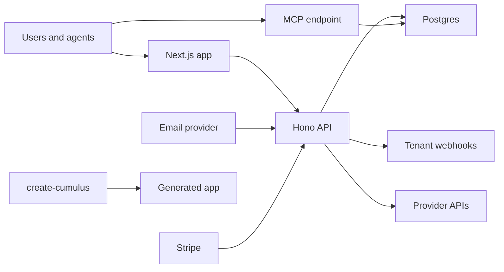

# Cumulus Relay Threat Model

## Executive Summary

Cumulus Relay is an internet-facing Next.js and Hono service that brokers agent signups, user sessions, tenant products, API keys, webhooks, MCP tools, billing, and optional provider automation. The highest-risk areas are credential storage, tenant isolation, signed webhook verification, agent-token authorization, inbound email parsing, and the generated `create-cumulus` templates that downstream users inherit.

## Scope And Assumptions

In scope: the root Relay app/server, `src/server/*`, `src/mcp/*`, `app/*`, migrations, scripts used for release verification, and `packages/create-cumulus`.

Out of scope: infrastructure settings not represented in this repo, npm/GitHub account controls, provider consoles, and private production data.

Assumptions:

- Public deployments terminate TLS at Vercel or an equivalent reverse proxy.
- `DATABASE_URL`, `MASTER_KEY`, `SESSION_SECRET`, provider keys, Stripe keys, and webhook secrets are stored only in deployment secrets.
- Hosted Cumulus Cloud and self-hosted Relay have the same core security objectives, but self-hosters own their database, email, billing, and provider credentials.
- Built-in providers are operator-owned. Tenant providers are third-party products registered through Relay and receive HMAC-signed webhooks.

Open questions that can change risk ranking:

- Whether production uses additional edge rate limits beyond the app-level limits.
- Whether production logs are centrally monitored for webhook, auth, billing, and MCP abuse.
- Whether commercial hosted deployments require stricter isolation than app-level tenant checks.

## System Model

### Primary Components

- Next.js App Router UI and route handlers: public pages, dashboards, login, discovery, hosted integration endpoints, and generated project templates.
- Hono/OpenAPI API: `/v1/*`, mounted in `src/server/app.ts`.
- MCP server: `/mcp`, Streamable HTTP transport, implemented in `src/mcp/server.ts`.
- Postgres schema and migrations: users, sessions, agents, tenants, providers, accounts, keys, billing, email, audit, and workflow tables.
- Workflow and provider integrations: Vercel Workflow DevKit, Neon, Vercel, Resend, SendGrid, Stripe, Sentry.
- Creator package: `packages/create-cumulus`, which packages Relay-branded generated apps.

Evidence anchors: `README.md`, `SELF_HOSTING.md`, `src/server/app.ts`, `src/server/auth.ts`, `src/server/db/schema.ts`, `packages/create-cumulus/src/templates.ts`.

### Data Flows And Trust Boundaries

- Internet user or agent -> Next.js UI and `/v1/*`: HTTP JSON, cookies, bearer tokens, request headers. Auth is session cookie or agent bearer token depending on route.
- Agent -> MCP `/mcp`: HTTP MCP messages. Tool-level auth maps bearer tokens to agent rows.
- Relay -> tenant product webhook: HTTP JSON signed with per-product HMAC secrets.
- Tenant product -> Relay activation and integration APIs: HTTP JSON with bearer auth or signed provider flows.
- SendGrid -> Relay inbound email webhook: HTTP form/email payloads gated by a shared webhook secret.
- Stripe -> Relay billing webhook: raw HTTP body verified by Stripe SDK signature checks.
- Relay -> Postgres: SQL through Drizzle and Neon driver. Sensitive values are encrypted or hashed before persistence.
- `create-cumulus` -> generated app: local file rendering with explicit tokens and an allow-listed template tree.

#### Diagram

## Assets And Security Objectives

| Asset | Why it matters | Objective |
| --- | --- | --- |
| `MASTER_KEY` and encrypted DB columns | Protects third-party API keys and webhook secrets | Confidentiality, integrity |
| Agent tokens and integrator keys | Authorize API and MCP actions | Confidentiality, integrity |
| Session cookies and passkeys | Human account access | Confidentiality, integrity |
| Tenant and user IDs | Multi-tenant isolation boundary | Integrity, confidentiality |
| Webhook secrets | Prevent forged product/signup/action calls | Integrity |
| Email inbox contents | May contain verification codes and links | Confidentiality |
| Billing and quota rows | Revenue and access control | Integrity, availability |
| Creator templates | Copied into customer projects | Integrity, supply chain |

## Attacker Model

### Capabilities

- Remote unauthenticated caller can reach public pages, discovery, login, signup, and selected bootstrap surfaces.
- Authenticated user or agent can call routes allowed by its session, token, scope, tenant, and workspace.
- Tenant-controlled product webhook endpoints can return malformed or hostile responses.
- Third-party providers can send malformed webhooks or delayed/replayed events.
- A downstream generated app operator can misconfigure env values.

### Non-Capabilities

- No direct database shell, deployment secret access, npm publishing access, or provider-console access is assumed.
- No ability to bypass TLS or modify signed webhook bodies is assumed.

## Entry Points And Attack Surfaces

| Surface | How reached | Trust boundary | Notes | Evidence |
| --- | --- | --- | --- | --- |
| `/v1/*` REST API | Public HTTP | Internet to API | Route-level auth and rate limits differ by endpoint | `src/server/app.ts` |
| `/mcp` | Public HTTP | Agent to MCP tools | Auth must hold at tool layer | `src/server/app.ts`, `src/mcp/server.ts` |
| `/.well-known/relay.json`, JWKS | Public HTTP | Discovery to callers | Public by design | `src/server/app.ts` |
| Email OTP and WebAuthn | Public HTTP | Browser to auth server | Session minting path | `src/server/routes/auth.ts`, `src/server/auth/session.ts` |
| Tenant product webhooks | Relay to third party | Relay to untrusted service | HMAC signing and response parsing are critical | `src/server/providers/webhook.ts` |
| Stripe webhook | Stripe to API | Third-party webhook | Uses raw body signature verification | `src/server/routes/billing.ts` |
| SendGrid inbound email | Email provider to API | Third-party webhook | Shared-secret gate | `src/server/routes/email-webhook.ts` |
| Creator CLI | Local shell | Developer input to filesystem | Overwrite protection and template allow-list matter | `packages/create-cumulus/src/core.ts`, `packages/create-cumulus/src/templates.ts` |

## Top Abuse Paths

1. Forge webhook -> trigger signup/action without valid HMAC -> create accounts or actions under another tenant.
2. Steal or guess agent token -> call MCP or `/v1/*` as a user or integrator -> exfiltrate keys or mutate resources.
3. Exploit tenant isolation bug -> use valid token from tenant A -> read or mutate tenant B data.
4. Abuse inbound email webhook -> inject verification links or large payloads -> control signup workflow or cause storage pressure.
5. Misconfigure generated app secrets -> deploy with dev placeholder HMAC secrets -> accept forged hosted callbacks.
6. Compromise `MASTER_KEY` -> decrypt stored provider credentials, webhook secrets, and account keys.
7. Abuse billing webhook idempotency -> duplicate credits, quota changes, or subscription state.
8. Poison creator package templates -> downstream projects inherit insecure routes or false legal/security docs.

## Threat Model Table

| Threat ID | Threat Source | Prerequisites | Threat Action | Impact | Impacted Assets | Existing Controls | Gaps | Recommended Mitigations | Detection Ideas | Likelihood | Impact Severity | Priority |
| --- | --- | --- | --- | --- | --- | --- | --- | --- | --- | --- | --- | --- |
| TM-001 | Remote caller | Missing or weak webhook secret | Forge agent-signup or action callback | Unauthorized account creation or action execution | Webhook secrets, tenant data | HMAC verification in generated webhook helpers and server webhook dispatch | Generated apps depend on env setup | Keep production fail-closed checks and add deployment smoke tests for missing secrets | Alert on `invalid_signature`, `*_secret_not_configured` | Medium | High | High |
| TM-002 | Authenticated tenant/user | Tenant scoping bug | Request another tenant or workspace resource | Cross-tenant data leak or mutation | Tenant rows, API keys, billing state | Route-level bearer/session auth and workspace fields | App-level checks must stay consistent | Add focused tests for every route with tenant/workspace IDs | Log denied cross-tenant access and unusual 403 bursts | Medium | High | High |
| TM-003 | Token thief | Agent or integrator token exposure | Use token before revocation or expiry | API/MCP impersonation | Agent tokens, accounts, API keys | Tokens are hashed at rest and checked for revocation/expiry | Client-side storage hygiene is outside server control | Keep short expiries for agent tokens and add rotation UX | Alert on impossible travel, high-volume token use | Medium | High | High |
| TM-004 | Email/webhook sender | Provider webhook reachable | Send malformed, replayed, or oversized payload | Workflow confusion or DoS | Inbound emails, signup jobs | Shared secret gates email webhook; Stripe SDK verifies Stripe webhook | App-level payload size/rate limits may rely on hosting edge | Configure reverse-proxy payload limits and per-webhook rate limits | Track 4xx/5xx webhook rates and payload sizes | Medium | Medium | Medium |
| TM-005 | Operator mistake | Production env incomplete | Deploy with missing secrets or default placeholders | Auth, HMAC, or encryption failures | Sessions, webhook secrets, DB encrypted data | Runtime checks exist for core secrets; generated templates now fail closed for production HMAC placeholders | Not all env requirements can be validated before deploy | Add `npm run env:check` before production deploy | Alert on startup/env validation failures | Medium | Medium | Medium |
| TM-006 | Supply-chain attacker | Compromise npm/GitHub release path | Publish altered creator package | Downstream projects inherit malicious code | Creator package, generated apps | Package tests, pack dry-run, secret scans, explicit template allow-list | Requires strong account controls outside repo | Use npm 2FA/granular tokens, signed tags/releases, provenance if available | Monitor npm package diff and GitHub release checksum | Low | High | Medium |

## Criticality Calibration

- Critical: remote auth bypass, private key or `MASTER_KEY` exposure, cross-tenant write/read with broad impact.
- High: forged webhooks, stolen long-lived agent token, billing integrity bug, generated template route that ships insecure by default.
- Medium: DoS of one webhook path, incomplete production headers, env misconfiguration caught at runtime.
- Low: public metadata leak, docs mismatch without runtime impact, dev-only warning.

## Focus Paths For Security Review

| Path | Why It Matters | Related Threat IDs |
| --- | --- | --- |
| `src/server/auth.ts` | Bearer and integrator auth boundary | TM-002, TM-003 |
| `src/server/auth/session.ts` | Session signing and cookie validation | TM-003 |
| `src/server/routes/dev.ts` | Tenant product registration and webhook secrets | TM-001, TM-002 |
| `src/server/routes/signups.ts` | Agent signup creation and status | TM-001, TM-002 |
| `src/server/routes/actions.ts` | Agent action dispatch and billing gate | TM-001, TM-002 |
| `src/server/routes/email-webhook.ts` | Inbound email verification channel | TM-004 |
| `src/server/routes/billing.ts` | Stripe webhook and quota integrity | TM-004, TM-006 |
| `src/server/providers/webhook.ts` | Outbound HMAC signing and retries | TM-001 |
| `src/mcp/server.ts` | MCP tool auth and input validation | TM-002, TM-003 |
| `packages/create-cumulus/src/templates.ts` | Template allow-list and generated package surface | TM-006 |
| `packages/create-cumulus/templates/integration` | Hosted/self-hosted inherited webhook routes | TM-001, TM-005 |

## Quality Check

- Entry points discovered in the repo are covered.
- Each major trust boundary appears in at least one threat.
- Runtime surfaces are separated from release and local creator tooling.
- Assumptions are explicit where deployment context is outside the repo.
- Ownership-map output was generated outside the repo and not committed because it contains contributor metadata.
